# CAVT Smart Admissions

A cross-platform smart admissions and branch administration application built with **Flutter** and **Supabase** for the College of Advanced Vocational Training (CAVT).

The system separates the applicant experience from the administration portal and routes each application to the correct branch. Branch administrators can access only applications assigned to their own branch.

## Highlights

### Student Experience
- Student account registration and secure sign-in
- Arabic and English interface
- Light and dark themes
- Browse vocational programs
- Browse CAVT branches
- Eligibility checker
- Program recommendation assistant
- Compare two programs
- Submit an admission application
- Upload supporting documents
- View submitted applications
- Track application status through the admissions workflow

### Administration Experience
- Separate administration portal
- Branch-based authorization
- Multiple administrator accounts per branch
- Branch dashboard and application statistics
- Search and filter branch applications
- Review applicant details
- Change application status
- Add reviewer notes
- View application workflow/history
- Student accounts blocked from the administration portal

## Technology Stack

- Flutter
- Dart
- Supabase
- PostgreSQL
- Supabase Authentication
- Supabase Storage
- Row Level Security (RLS)
- Git & GitHub

## Security Model

The backend uses both role-based and branch-based authorization. Supabase Row Level Security restricts staff access so administrators can manage only applications belonging to their assigned branch.

Private administrator passwords and backup files are not stored in this repository. Sensitive personal values in portfolio screenshots are redacted.

## Screenshots

### Portal & Student Experience

<table>
<tr>
<td align="center"><strong>Portal Login</strong><br>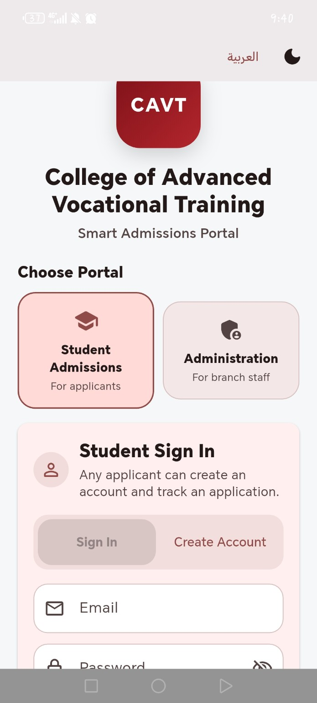</td>
<td align="center"><strong>Student Home</strong><br>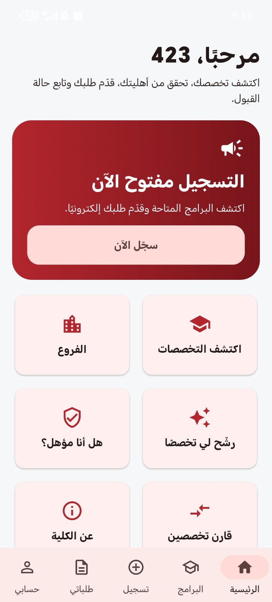</td>
</tr>
<tr>
<td align="center"><strong>Programs</strong><br>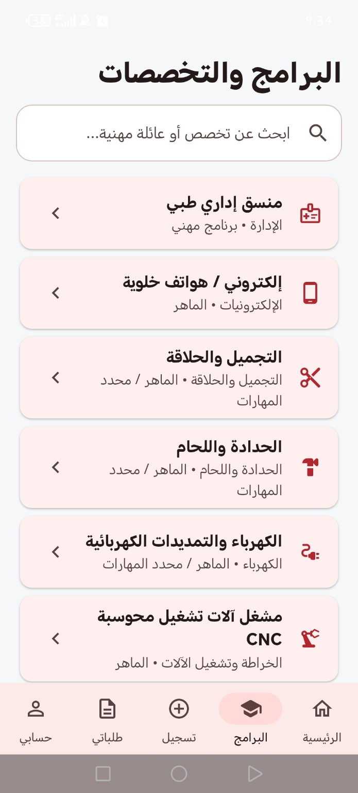</td>
<td align="center"><strong>Branches</strong><br>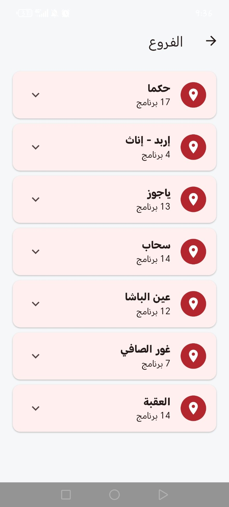</td>
</tr>
<tr>
<td align="center"><strong>Eligibility Check</strong><br>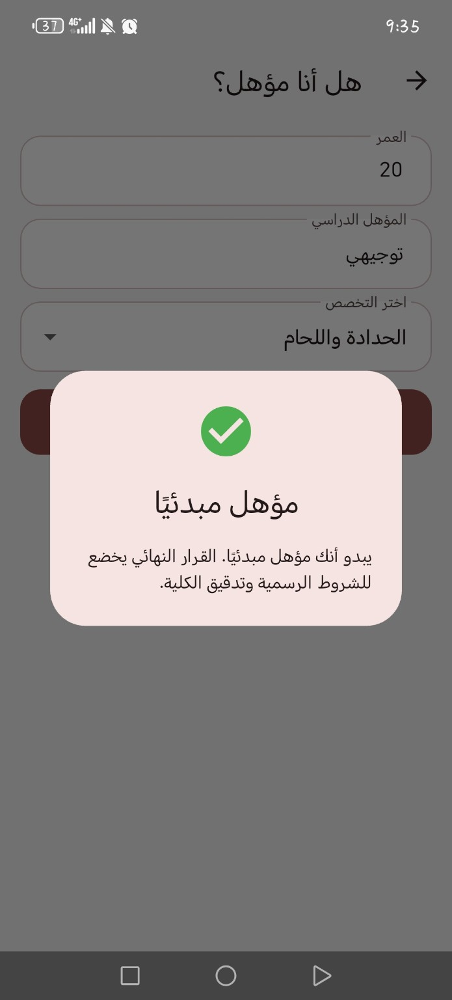</td>
<td align="center"><strong>Program Recommender</strong><br>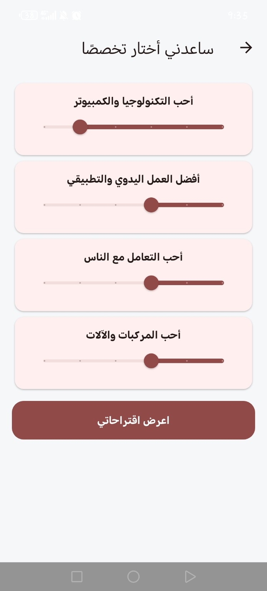</td>
</tr>
<tr>
<td align="center"><strong>Compare Programs</strong><br>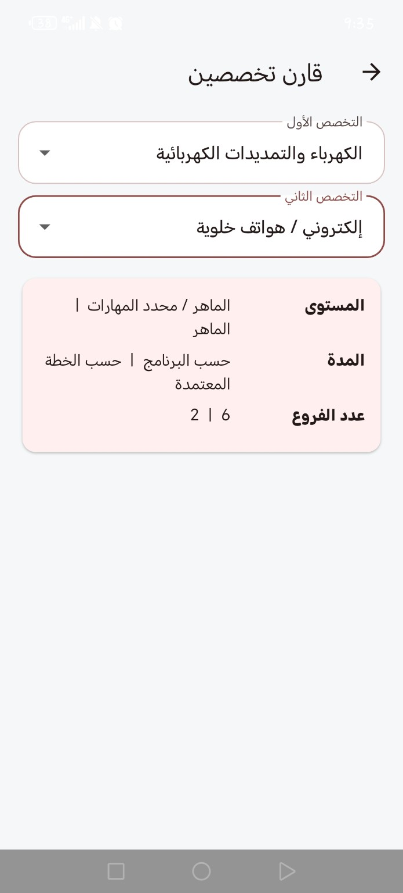</td>
<td align="center"><strong>Application Form</strong><br>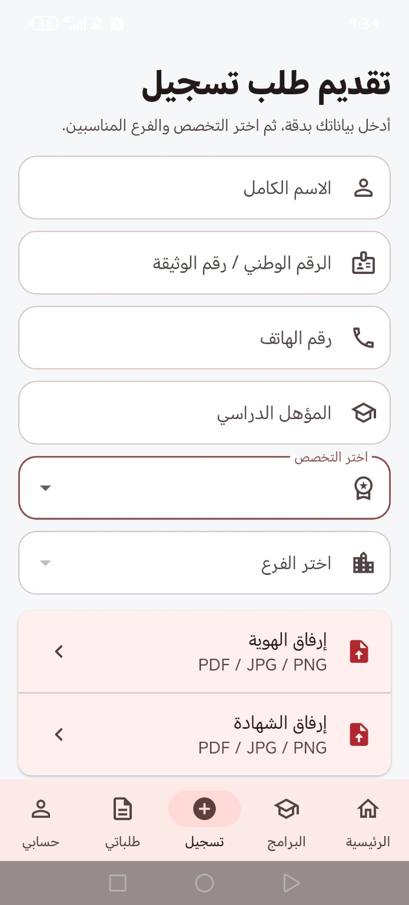</td>
</tr>
<tr>
<td align="center"><strong>My Applications</strong><br>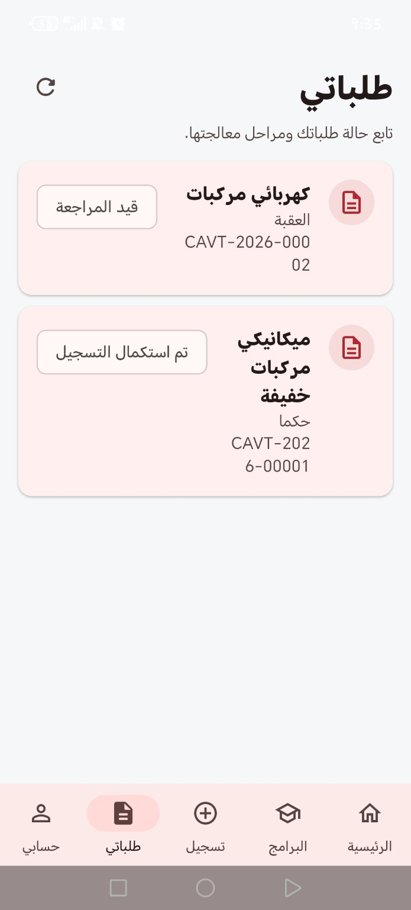</td>
<td align="center"><strong>Application Tracking</strong><br>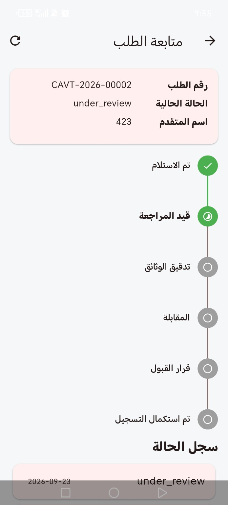</td>
</tr>
</table>

### Administration Experience

<table>
<tr>
<td align="center"><strong>Portal Protection</strong><br>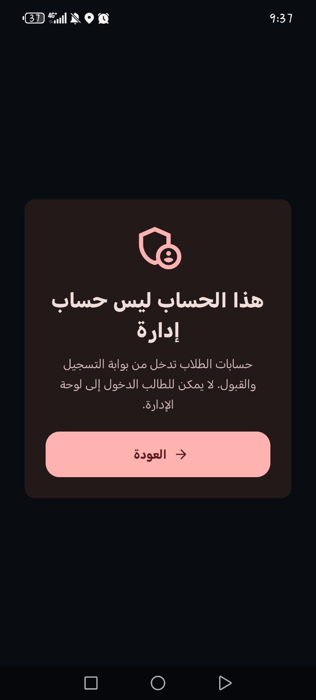</td>
<td align="center"><strong>Branch Dashboard</strong><br>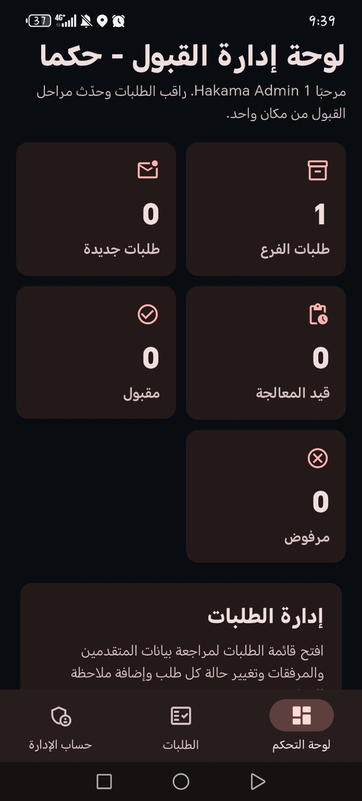</td>
</tr>
<tr>
<td align="center"><strong>Branch Applications</strong><br>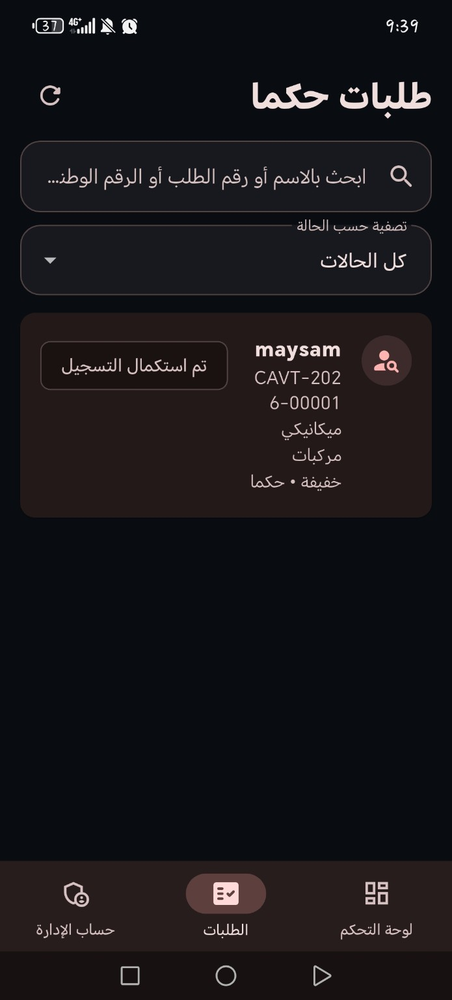</td>
<td align="center"><strong>Application Review</strong><br>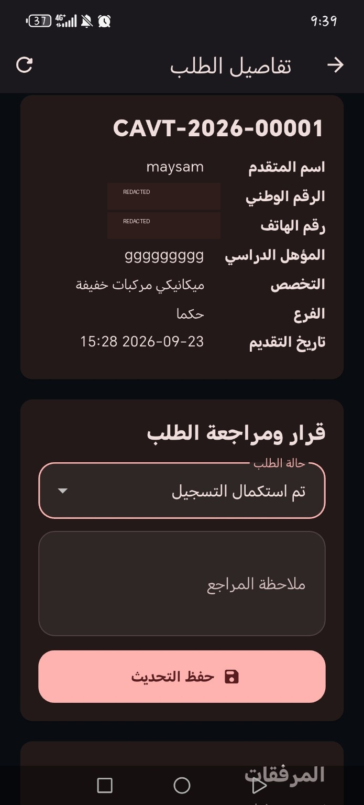</td>
</tr>
<tr>
<td align="center"><strong>Status Update</strong><br>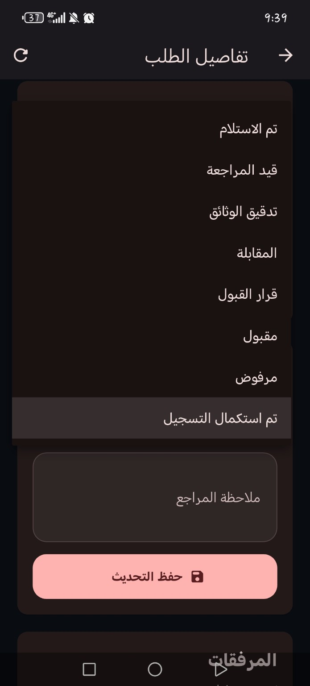</td>
<td align="center"><strong>Admin Account</strong><br>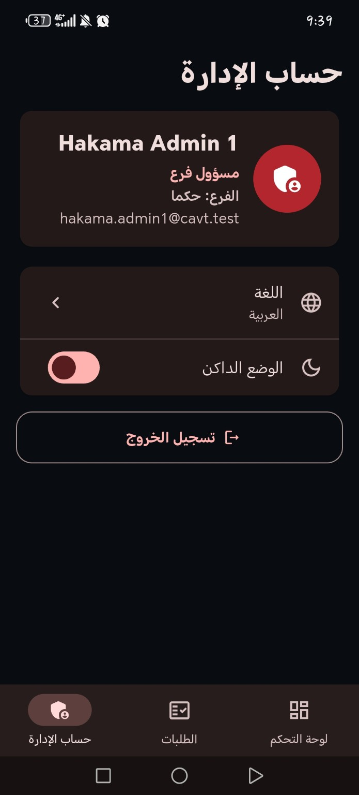</td>
</tr>
</table>

## Additional Screenshot

The repository also includes an additional student-home view:

- `screenshots/17_student_home_secondary.jpg`

## Tested Workflow

The project has been tested with:
- Student authentication
- Application submission
- Supporting-document upload
- Application tracking
- Status history
- Separate student/admin portals
- Branch-specific administration
- Multiple administrator accounts per branch
- Row Level Security enforcement

## Local Setup

1. Install Flutter.
2. Clone the repository.
3. Run:

```bash
flutter pub get
```

4. Configure your own Supabase project URL and publishable key.
5. Run:

```bash
flutter run
```

## Portfolio Note

This repository is a portfolio/development project demonstrating a complete admissions workflow and branch-based administration architecture. It does not include production credentials or private administrator passwords.
