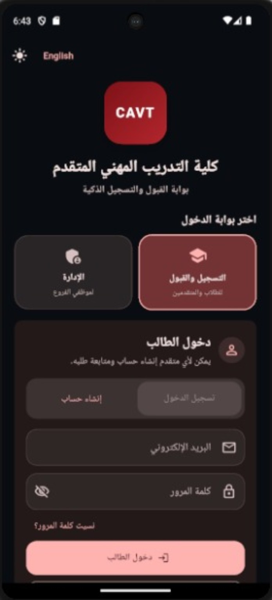
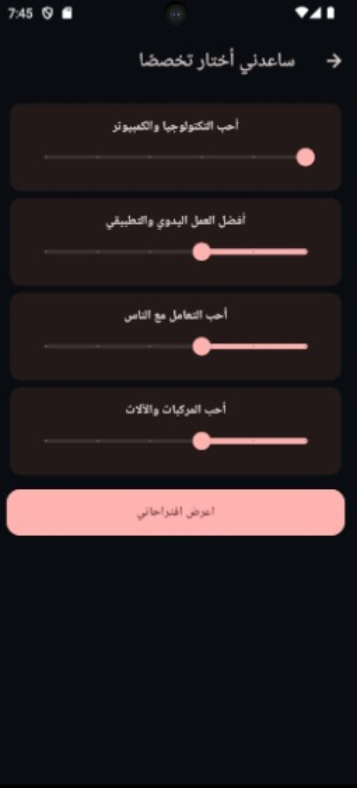
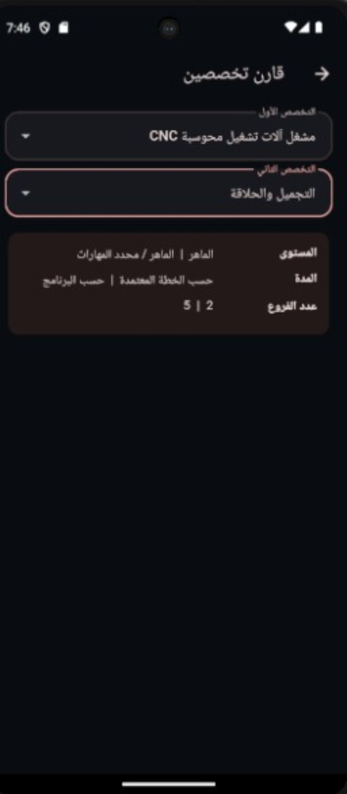
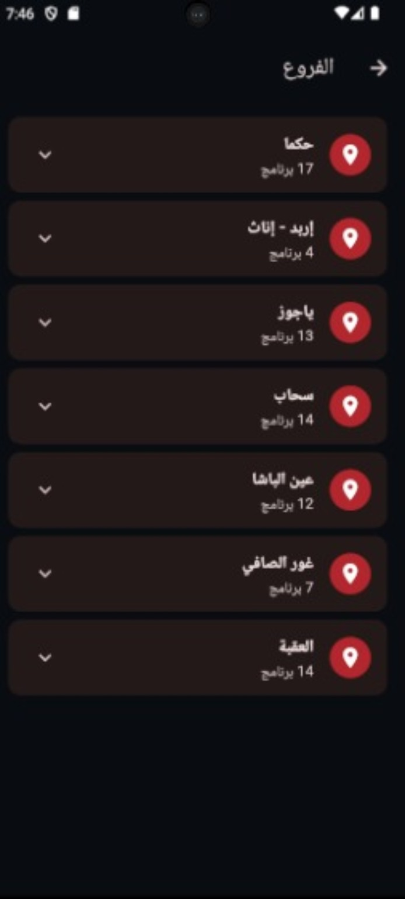
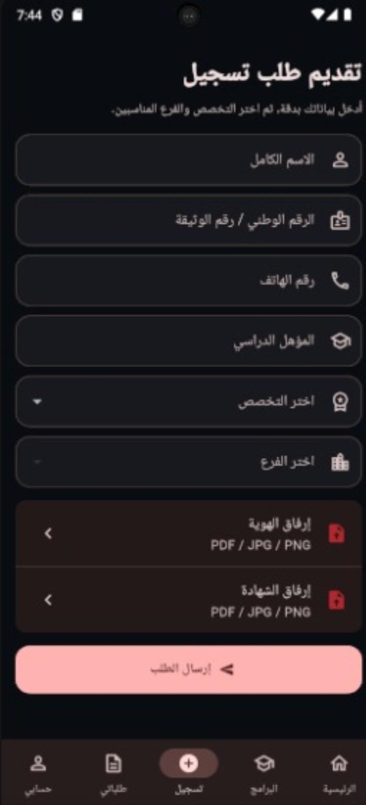
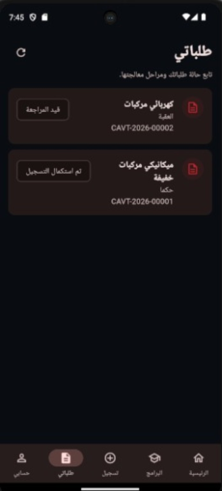
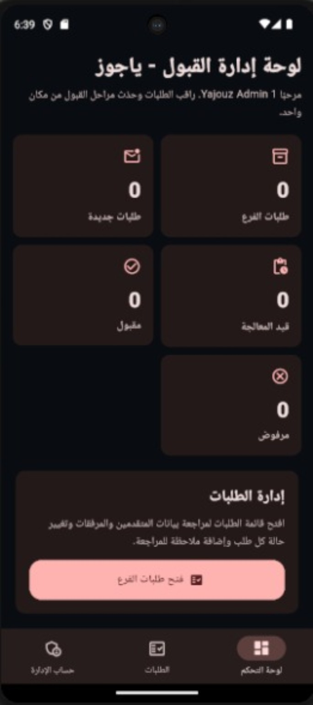
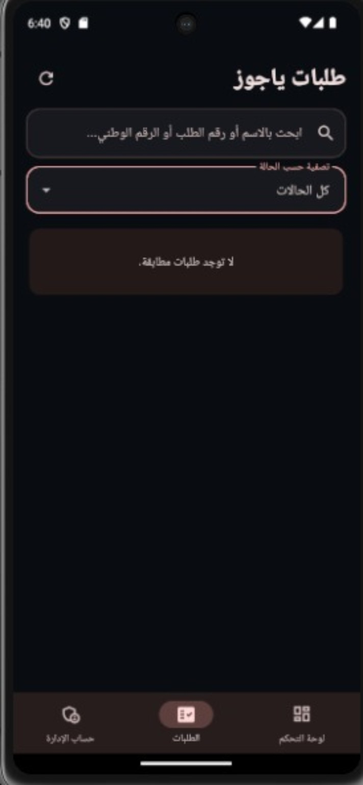
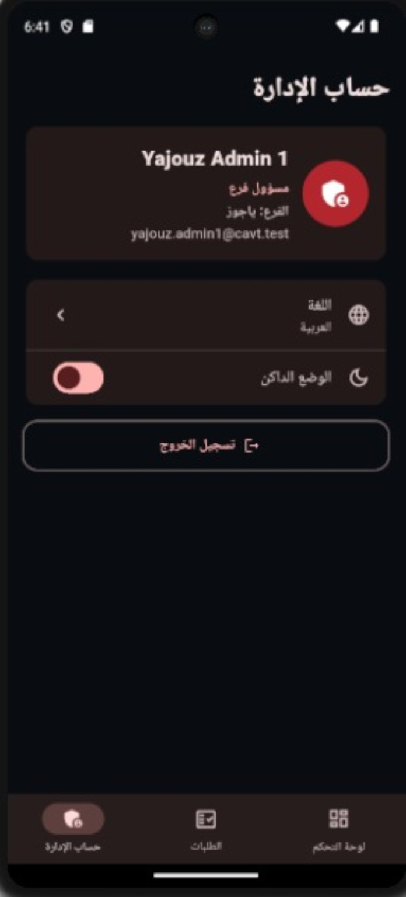

# CAVT Smart Admissions

A smart admissions and branch administration system built with Flutter and Supabase for the College of Advanced Vocational Training (CAVT).

The application separates the student admissions experience from the administrative portal and routes each application to the correct branch. Branch administrators can review only the applications assigned to their own branch.

## Key Features

### Student Portal
- Student account registration and secure sign-in
- Browse vocational programs and branches
- Program recommendation assistant
- Compare programs
- Submit admission applications with document uploads
- Track submitted applications
- Arabic interface with English language option
- Light and dark theme support

### Administration Portal
- Separate administration login
- Branch-based access control
- Multiple administrator accounts per branch
- Branch-specific dashboard
- Search and filter applications
- Review and update applications
- Secure logout

## Technology Stack
- Flutter
- Dart
- Supabase
- PostgreSQL
- Supabase Authentication
- Supabase Storage
- Row Level Security (RLS)
- Git & GitHub

## Security Model

The application uses role-based and branch-based authorization. Supabase Row Level Security (RLS) limits administrative access so each branch administrator can access only applications assigned to that branch.

Administrator credentials and private backup files are not stored in this repository.

## Screenshots

### Entry & Student Experience

<table>
<tr>
<td align="center"><strong>Portal Login</strong> </td>
<td align="center"><strong>Student Home</strong> </td>
</tr>
<tr>
<td align="center"><strong>Programs</strong> </td>
<td align="center"><strong>Program Recommender</strong> </td>
</tr>
<tr>
<td align="center"><strong>Compare Programs</strong> </td>
<td align="center"><strong>Branches</strong> </td>
</tr>
<tr>
<td align="center"><strong>Application Form</strong> </td>
<td align="center"><strong>My Applications</strong> </td>
</tr>
</table>

### Administration Experience

<table>
<tr>
<td align="center"><strong>Branch Dashboard</strong> </td>
<td align="center"><strong>Branch Applications</strong> </td>
</tr>
<tr>
<td align="center"><strong>Admin Account</strong> </td>
<td></td>
</tr>
</table>

## Current Status
Implemented and tested:
- Authentication
- Student and administration portals
- Application submission and tracking
- Supporting-document upload flow
- Branch-specific administration
- Multiple administrators per branch
- Row Level Security enforcement
- Program browsing, recommendation, and comparison

## Local Setup
1. Install Flutter.
2. Clone the repository.
3. Run `flutter pub get`.
4. Configure your own Supabase project URL and publishable key.
5. Run `flutter run`.

## Disclaimer
This is a portfolio and development project demonstrating an admissions workflow and branch-based administration system. It does not contain production administrator credentials or private user data.
